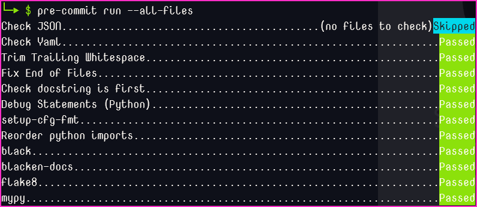

# Local developer installation

It is **strongly** recommended to use a virtual environment ([`venv`](https://docs.python.org/3/library/venv.html)) when working with python projects. Leveraging a `venv` will ensure the installed dependency files will not impact other python projects or any system dependencies.

The following steps outline how to install this repo for local development. See the [CONTRIBUTING.md](../CONTRIBUTING.md) file in the repo root for information on contributing to the repo.

**Windows users**: Depending on your python install you will use `py` in place of `python` to create the `venv`.

**Linux/Mac users**: Replace `python`, if needed, with the appropriate call to the desired version while creating the `venv`. (e.g. `python3` or `python3.8`)

**All users**: Once inside an active `venv` all systems should allow the use of `python` for command line instructions. This will ensure you are using the `venv`'s python and not the system level python.

---

## Installation steps:

Clone this repo and enter root directory of repo:

```bash
$ git clone https://github.com/{{ORG_NAME}}/{{REPO_NAME}}
$ cd {{REPO_NAME}}
```

Create the `venv`:

```bash
python -m venv venv
```

Activate the `venv`:

```bash
# Linux/Mac
. venv/bin/activate

# Windows
venv\Scripts\activate
```

The command prompt should now have a `(venv)` prefix on it. `python` will now call the version of the interpreter used to create the `venv`

Install editable library and development requirements:

```bash
# Update pip and tools
python -m pip install --upgrade pip wheel setuptools

# Install development requirements
python -m pip install -r requirements-dev.txt

# Install editable version of library
python -m pip install --editable .
```

Install pre-commit [(see below for details)](#pre-commit):

```bash
pre-commit install
```

---
## Misc Steps:

Run pre-commit on all files:

```bash
pre-commit run --all-files
```

Run tests:

```bash
tox
```

To deactivate (exit) the `venv`:
```bash
deactivate
```

---

## [pre-commit](https://pre-commit.com)

> A framework for managing and maintaining multi-language pre-commit hooks.

This repo is setup with a `.pre-commit-config.yaml` with the expectation that any code submitted for review already passes all selected pre-commit checks. `pre-commit` is installed with the development requirements and runs seemlessly with `git` hooks.



---

## Makefile

This repo has a Makefile with some quality of life scripts if the system supports `make`.  Please note there are no checks for an active `venv` in the Makefile.

|PHONY|Description|
|--|--|
| `init` | Update pip, setuptools, and wheel to newest version |
| `dev-install` | install development requirements and project |
| `update` | Run any update scripts for requirements |
| `build-dist` | Build source distribution and wheel distribution |
| `clean-artifacts` | Deletes python/mypy artifacts including eggs, cache, and pyc files |
| `clean-tests` | Deletes tox, coverage, and pytest artifacts |
| `clean-build` | Deletes build artifacts |
| `clean-all` | Runs all clean scripts |
